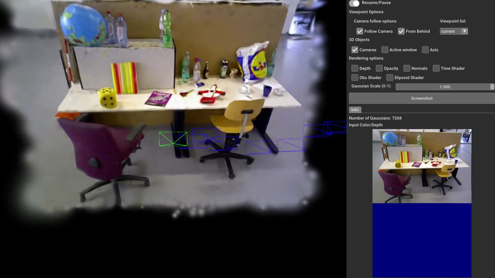
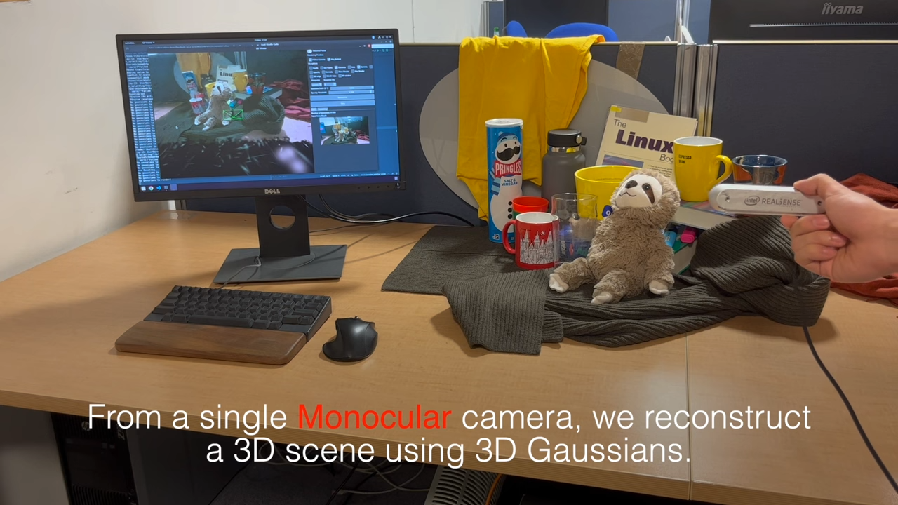

[comment]: <> (# Gaussian Splatting SLAM)

<!-- PROJECT LOGO -->

<p align="center">

  <h1 align="center"> Gaussian Splatting SLAM
  </h1>
  <p align="center">
    <a href="https://muskie82.github.io/"><strong>*Hidenobu Matsuki</strong></a>
    ·
    <a href="https://rmurai.co.uk/"><strong>*Riku Murai</strong></a>
    ·
    <a href="https://www.imperial.ac.uk/people/p.kelly/"><strong>Paul H.J. Kelly</strong></a>
    ·
    <a href="https://www.doc.ic.ac.uk/~ajd/"><strong>Andrew J. Davison</strong></a>
  </p>
  <p align="center">(* Equal Contribution)</p>

  <h3 align="center"> CVPR 2024 (Highlight)</h3>


[comment]: <> (  <h2 align="center">PAPER</h2>)
  <h3 align="center"><a href="https://arxiv.org/abs/2312.06741">Paper</a> | <a href="https://youtu.be/x604ghp9R_Q?si=nYoWr8h2Xh-6L_KN">Video</a> | <a href="https://rmurai.co.uk/projects/GaussianSplattingSLAM/">Project Page</a></h3>
  <div align="center"></div>

<p align="center">
  <a href="">
    
  </a>
  <a href="">
    
  </a>
</p>
<p align="center">
This software implements dense SLAM system presented in our paper <a href="https://arxiv.org/abs/2312.06741">Gaussian Splatting SLAM</a> in CVPR'24.
The method demonstrates the first monocular SLAM solely based on 3D Gaussian Splatting (left), which also supports Stereo/RGB-D inputs (middle/right).
</p>
<br>

# Note
- In an academic paper, please refer to our work as **Gaussian Splatting SLAM** or **MonoGS** for short (this repo's name) to avoid confusion with other works.
- Differential Gaussian Rasteriser with camera pose gradient computation is available [here](https://github.com/rmurai0610/diff-gaussian-rasterization-w-pose.git).
- **[New]** Speed-up version of our code is available in `dev.speedup` branch, It achieves up to 10fps on monocular fr3/office sequence while keeping consistent performance (tested on RTX4090/i9-12900K). The code will be merged into the main branch after further refactoring and testing.

# Getting Started
## Installation
```
git clone https://github.com/nhatsonle/MonoGS.git --recursive
cd MonoGS
```

Setup the environment.cd M

> **Tested with Python 3.10, CUDA 11.x/12.x.**
> This stack **must** run on NumPy 1.x. Several C-extensions (OpenCV, `numpy-quaternion`) are compiled against the NumPy 1.x ABI, and the data loaders use APIs removed in NumPy 2.0 (e.g. `np.unicode_`). NumPy 2.x will crash at runtime.

```bash
apt-get update && apt-get install -y \
    libgl1-mesa-glx \
    libglib2.0-0 \
    libegl1-mesa \
    libgles2-mesa \
    libosmesa6-dev \
    freeglut3-dev \
    && rm -rf /var/lib/apt/lists/*
```

The install is split into separate steps **on purpose**. Running every package in one giant
`pip install` is fragile: if any single package fails to resolve, pip aborts the whole command and
**none** of the later packages get installed (this is why `imgviz` or `torchmetrics` can silently
go missing). A second package can also pull in NumPy 2.x and overwrite the pinned 1.26.4, leaving a
broken install with two `numpy-*.dist-info` folders. The steps below prevent both problems.

```bash
# Step 0: write a constraints file that hard-locks NumPy for EVERY later pip call.
# This is the key fix — it stops any dependency from silently upgrading NumPy to 2.x.
echo "numpy==1.26.4" > /tmp/monogs-constraints.txt

# Step 1: install the pinned NumPy first.
pip install -c /tmp/monogs-constraints.txt numpy==1.26.4

# Step 2: core dependencies, in small groups so a failure can't hide later packages.
#   -c .../constraints.txt           -> NumPy can never be upgraded past 1.26.4
#   --upgrade-strategy only-if-needed -> don't gratuitously bump already-satisfied deps
PIP="python -m pip install -c /tmp/monogs-constraints.txt --upgrade-strategy only-if-needed"

$PIP scipy matplotlib pandas networkx tqdm pyyaml ninja imgviz munch rich ruff gdown
$PIP "opencv-python>=4.9" einops plyfile==0.8.1 trimesh roma
$PIP numpy-quaternion==2023.0.2
$PIP pycolmap evo lpips tensorboard wandb torchmetrics==1.4.0.post0
$PIP pyopengl pyrender glfw pyglm==2.7.1
$PIP huggingface-hub cvxpy
$PIP open3d

# Step 3: fix blinker conflict then reinstall open3d (still NumPy-locked)
pip install -c /tmp/monogs-constraints.txt open3d --ignore-installed blinker

# Step 4: submodules
pip install -c /tmp/monogs-constraints.txt submodules/simple-knn
pip install -c /tmp/monogs-constraints.txt submodules/diff-gaussian-rasterization

# Step 5: VERIFY the environment is healthy before running anything.
# Expected: NumPy 1.26.4, exactly one numpy dist-info, and no missing modules.
python -c "import numpy; assert numpy.__version__ == '1.26.4', numpy.__version__; print('numpy OK:', numpy.__version__)"
ls -d "$(python -c 'import site; print(site.getsitepackages()[0])')"/numpy-*.dist-info   # should print exactly ONE line
python -c "import imgviz, torchmetrics, pyrender, evo, lpips, open3d, cv2, quaternion; print('all imports OK')"
```

> **Notes**
> - `numpy-quaternion>=2024` requires `numpy>=1.25` and is incompatible with this stack — use `2023.0.2` as above.
> - If you ever see `AttributeError: np.unicode_ was removed` or a `ModuleNotFoundError`, your NumPy
>   was upgraded to 2.x (often leaving two `numpy-*.dist-info` folders). Fix it by uninstalling NumPy
>   **twice** (to clear both copies), then reinstalling the pin:
>   ```bash
>   pip uninstall -y numpy; pip uninstall -y numpy
>   pip install numpy==1.26.4
>   ```

Compile the cuda kernels for RoPE (as in CroCo v2 and DUSt3R).
```bash
cd croco/models/curope/
python setup.py build_ext --inplace
cd ../../../
```

Checkpoints
You can download the 'DUSt3R_ViTLarge_BaseDecoder_512_dpt.pth' checkpoint from the DUSt3R code repository, and save it to the 'checkpoints' folder.

Alternatively, download it directly using the following method:

```
mkdir -p checkpoints/
wget https://download.europe.naverlabs.com/ComputerVision/DUSt3R/DUSt3R_ViTLarge_BaseDecoder_512_dpt.pth -P checkpoints/
```
Depending on your setup, please change the dependency version of pytorch/cudatoolkit in `environment.yml` by following [this document](https://pytorch.org/get-started/previous-versions/).

Our test setup were:
- Ubuntu 20.04: `pytorch==1.12.1 torchvision==0.13.1 torchaudio==0.12.1 cudatoolkit=11.6`
- Ubuntu 18.04: `pytorch==1.12.1 torchvision==0.13.1 torchaudio==0.12.1 cudatoolkit=11.3`

## Quick Demo
```
bash scripts/download_tum.sh
python slam.py --config configs/mono/tum/fr3_office.yaml
```
You will see a GUI window pops up.

## Downloading Datasets
Running the following scripts will automatically download datasets to the `./datasets` folder.
### TUM-RGBD dataset
```bash
bash scripts/download_tum.sh
```

### Replica dataset
```bash
bash scripts/download_replica.sh
```

### EuRoC MAV dataset
```bash
bash scripts/download_euroc.sh
```


## Run
### Monocular
```bash
python slam.py --config configs/mono/tum/fr3_office.yaml
```

### RGB-D
```bash
python slam.py --config configs/rgbd/tum/fr3_office.yaml
```

```bash
python slam.py --config configs/rgbd/replica/office0.yaml
```
Or the single process version as
```bash
python slam.py --config configs/rgbd/replica/office0_sp.yaml
```


### Stereo (experimental)
```bash
python slam.py --config configs/stereo/euroc/mh02.yaml
```

## Live demo with Realsense
First, you'll need to install `pyrealsense2`.
Inside the conda environment, run:
```bash
pip install pyrealsense2
```
Connect the realsense camera to the PC on a **USB-3** port and then run:
```bash
python slam.py --config configs/live/realsense.yaml
```
We tested the method with [Intel Realsense d455](https://www.mouser.co.uk/new/intel/intel-realsense-depth-camera-d455/). We recommend using a similar global shutter camera for robust camera tracking. Please avoid aggressive camera motion, especially before the initial BA is performed. Check out [the first 15 seconds of our YouTube video](https://youtu.be/x604ghp9R_Q?si=S21HgeVTVfNe0BVL) to see how you should move the camera for initialisation. We recommend to use the code in `dev.speed-up` branch for live demo.

<p align="center">
  <a href="">
    
  </a>
</p>

# Troubleshooting

## `cameraMatrix is not a numpy array` (cv2.initUndistortRectifyMap)

**Cause:** `opencv-python<=4.8.x` is compiled against NumPy 1.x ABI and fails silently with NumPy 2.x, reporting every array as an invalid argument.

**Fix:** upgrade OpenCV (not downgrade NumPy — other packages like `torch`, `open3d`, `scipy` may require NumPy 2.x):
```bash
pip install --upgrade "opencv-python>=4.9"
```

If you see this error alongside `scipy`/`torch` import failures due to NumPy version conflicts, the root cause is a mixed-version install. The safe combination for this repo is:
- `numpy==1.26.4` + `opencv-python>=4.9` (OpenCV 4.9+ supports both NumPy 1.x and 2.x)
- Do **not** mix `opencv-python==4.8.x` with `numpy>=2.0`

# Evaluation
<!-- To evaluate the method, please run the SLAM system with `save_results=True` in the base config file. This setting automatically outputs evaluation metrics in wandb and exports log files locally in save_dir. For benchmarking purposes, it is recommended to disable the GUI by setting `use_gui=False` in order to maximise GPU utilisation. For evaluating rendering quality, please set the `eval_rendering=True` flag in the configuration file. -->
To evaluate our method, please add `--eval` to the command line argument:
```bash
python slam.py --config configs/mono/tum/fr3_office.yaml --eval
```
This flag will automatically run our system in a headless mode, and log the results including the rendering metrics.

# Reproducibility
There might be minor differences between the released version and the results in the paper. Please bear in mind that multi-process performance has some randomness due to GPU utilisation.
We run all our experiments on an RTX 4090, and the performance may differ when running with a different GPU.

# Acknowledgement
This work incorporates many open-source codes. We extend our gratitude to the authors of the software.
- [3D Gaussian Splatting](https://github.com/graphdeco-inria/gaussian-splatting)
- [Differential Gaussian Rasterization
](https://github.com/graphdeco-inria/diff-gaussian-rasterization)
- [SIBR_viewers](https://gitlab.inria.fr/sibr/sibr_core)
- [Tiny Gaussian Splatting Viewer](https://github.com/limacv/GaussianSplattingViewer)
- [Open3D](https://github.com/isl-org/Open3D)
- [Point-SLAM](https://github.com/eriksandstroem/Point-SLAM)

# License
MonoGS is released under a **LICENSE.md**. For a list of code dependencies which are not property of the authors of MonoGS, please check **Dependencies.md**.

# Citation
If you found this code/work to be useful in your own research, please considering citing the following:

```bibtex
@inproceedings{Matsuki:Murai:etal:CVPR2024,
  title={{G}aussian {S}platting {SLAM}},
  author={Hidenobu Matsuki and Riku Murai and Paul H. J. Kelly and Andrew J. Davison},
  booktitle={Proceedings of the IEEE/CVF Conference on Computer Vision and Pattern Recognition},
  year={2024}a
}

```


